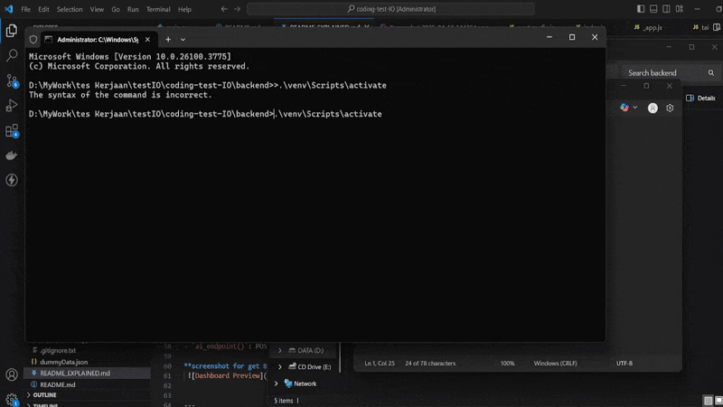

## 📸 Preview

Here’s what the app looks like:





```markdown

## 🔹 Frontend (Next.js)

### `index.js`

Main UI of the dashboard:
- Fetches data from `/api/sales-reps`
- Allows user to ask a question via `/api/ai`
- Filters and sorts users by region or total deal value
- Displays:
  - Bar chart (using `recharts`)
  - User cards (name, region, skills, deals, clients)


**Key Functions:**
- `getTotalDealValue(user)`: Calculate total value of a user's deals
- `filteredUsers`: Memoized list of users based on selected region and sort toggle
- `handleAskQuestion`: Sends POST request to backend AI endpoint


**UI Libraries:**
- `TailwindCSS` for styling
- `Recharts` for interactive charts

### `_app.js`

Global layout wrapper, imports `globals.css`.

### `globals.css`

Base Tailwind setup.

---

## 🔹 Backend (FastAPI)


### `main.py`

- `/api/sales-reps`: Returns static dummy data from `dummyData.json`
- `/api/ai`: Receives user question, returns random placeholder AI response

**Key Parts:**
- `DUMMY_DATA`: Loaded from JSON
- `DUMMY_RESPONSES`: Rotating fake AI replies
- `ai_endpoint()`: POST request handler that simulates AI response


**To run BE**
-  .\venv\Scripts\activate
-  uvicorn main:app --host 0.0.0.0 --port 8000 --reload

---

## 📝 Notes

This is a test project. The AI is not connected to a real model yet.

DUMMY_RESPONSES = [
    "Hmm, menarik! Tapi saya hanya AI palsu 😅",
    "Maaf, saya belum cukup pintar untuk menjawab itu 😁",
    "Pertanyaan bagus! Tapi saya hanya placeholder bot.",
    "Aku belum nyambung ke AI sungguhan, tapi terima kasih sudah bertanya!",
]

---